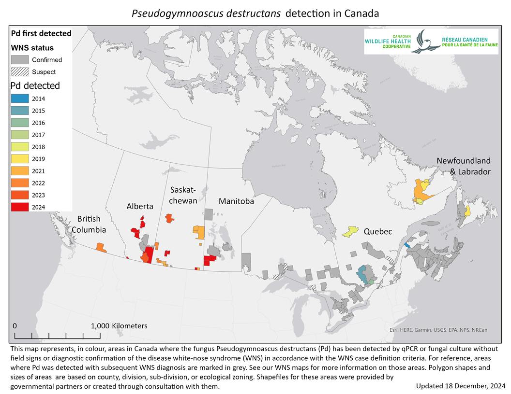
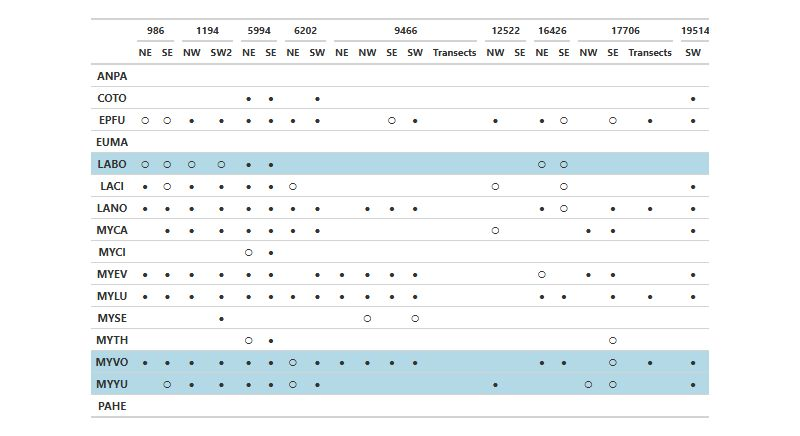
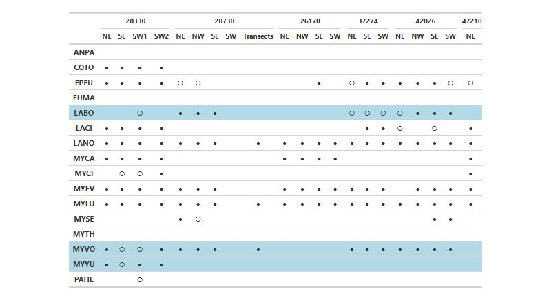
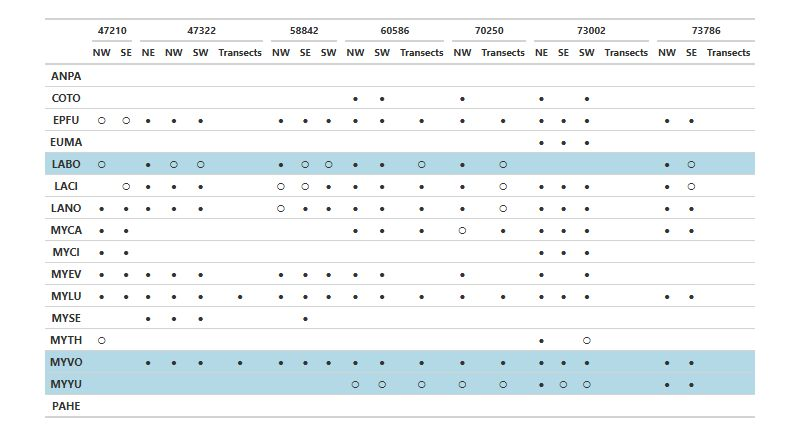
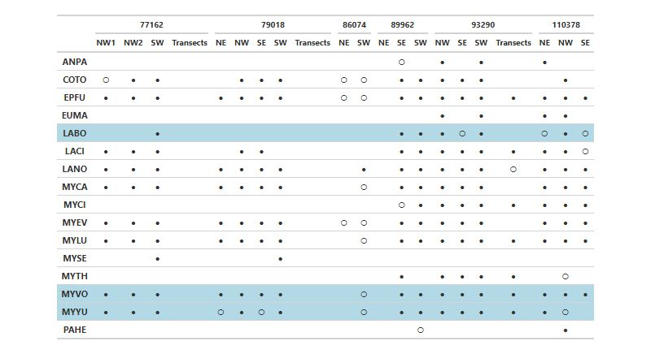
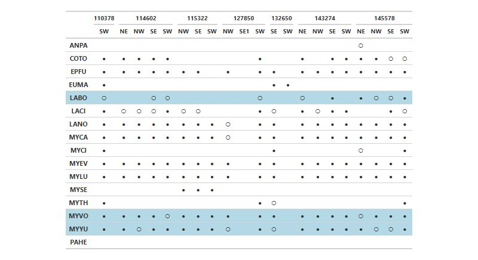
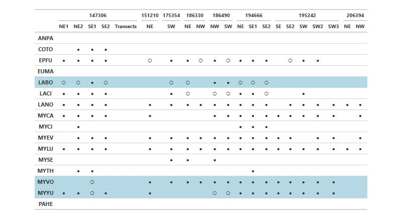
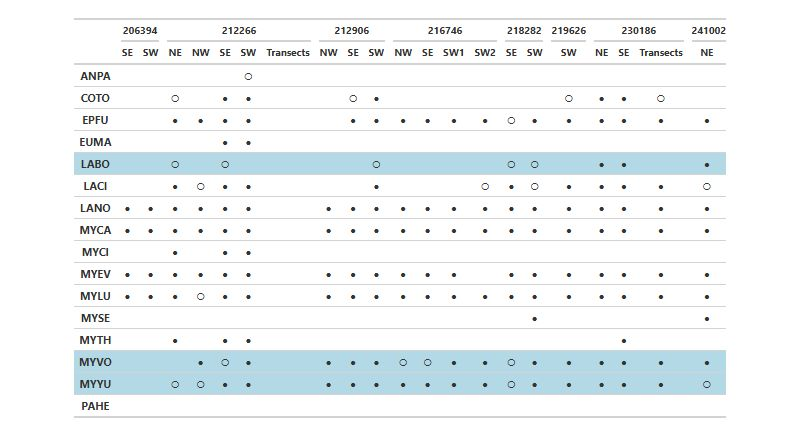
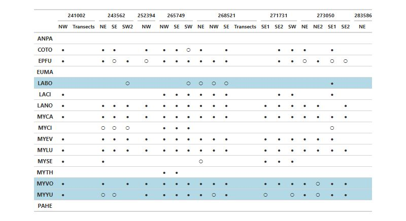
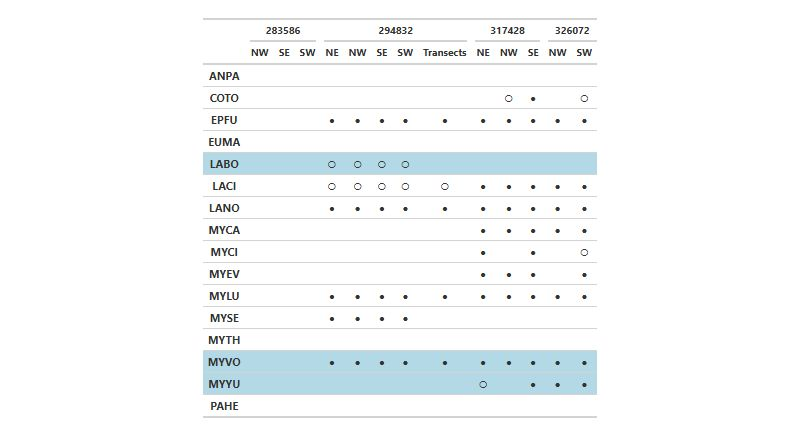

::: {.content-visible when-format="html"}
.jpg)
:::

```{r}
#| label: setup - load libraries, data and create covariates in models table
#| include: false
#| echo: false
#| eval: true
#| warning: false
#| message: false

# Display with kable for nice formatting
library(knitr)
library(sf)
library(ggplot2)
library(dplyr)
library(tinytex)
library(quarto)
library(lubridate)
library(flextable)
library(tidyverse)
library(readr)
library(reactable)
library(leaflet)
library(leaflet.extras)
library(kableExtra)
library(gt)


# Ensure proper initialization order
options(htmlwidgets.TOJSON_ARGS = list(na = 'string'))

#load sampling effort csv
samplingE <- read.csv("Data/SamplingEffort.csv")
#remove extra column with numebrs
samplingE$X <- NULL

# Load the model covariates summary table
model_covariates <- read.csv("Data/Analyzed/ModelVariables.csv")
transect_covariates <- read.csv("Data/Analyzed/ModelVariables_Transect.csv")
#this comes from running the ModelSelection.R code where it runs all of the covariates and chooses the best model best on AIC

#format the covariates df 

# Species code to common name lookup
species_names <- c(
  ANPA = "Pallid Bat",
  COTO = "Townsend's Big-eared Bat",
  EPFU = "Big Brown Bat",
  EUMA = "Spotted Bat",
  LABO = "Eastern Red Bat",
  LACI = "Hoary Bat",
  LANO = "Silver-haired Bat",
  MYLU = "Little Brown Myotis",
  MYYU = "Yuma Myotis",
  MYEV = "Long-eared Myotis",
  MYTH = "Fringed Myotis",
  MYVO = "Long-legged Myotis",
  MYCA = "California Myotis",
  MYCI = "Western Small-footed Myotis",
  PAHE = "Canyon Bat",
  TABR = "Mexican Free-tailed Bat",
  MYSE = "Northern Myotis"
)

# Clean covariate from models and format for report
clean_covars <- function(x) {
  x %>%
    gsub("\\.", " ", .) %>%                          # replace dots with spaces
    gsub("\\bdd\\b", "Degree Days", .) %>%           # dd -> Degree Days
    gsub("Temp\\b", "Temperature", .) %>%            # Temp -> Temperature
    gsub("Windsp\\b", "Wind Speed", .) %>%           # Windsp -> Wind Speed
    gsub("Clutterdist\\b", "Distance to Clutter", .) %>%  # Clutterdist -> Distance to Clutter
    gsub("mtime2h mphase", "Moon", .) %>%      # mtime2h mphase -> Moon Phase
    gsub(",\\s*I\\(YearS\\^2\\)|I\\(YearS\\^2\\),?\\s*", "", .) %>% #remove quadratic term from the reporting 
    trimws()
}

model_covariates<- model_covariates %>%
  mutate(
    Common_Name = species_names[sp],
    Covariates = clean_covars(vars)
  ) %>%
  select(Common_Name, Species_Code = sp, Covariates)

transect_covariates<- transect_covariates %>%
  mutate(
    Common_Name = species_names[sp],
    Covariates = clean_covars(vars)
  ) %>%
  select(Common_Name, Species_Code = sp, Covariates)

####-------------------------------------------------------------------#####
#to render to pdf copy this code to and run it directly in the console.
#it cannto run if it's within the same quarto document

#library(tinytex)
#library(quarto)
#quarto::quarto_render("NABat-BC_2016-2024.qmd", output_format = "pdf")
```

```{r}
#| label: setup - create species detection table
#| include: false
#| echo: false
#| eval: true
#| warning: false
#| message: false
#| 
#####-------Species Precense Tables---------#
# Create species name mapping
species_names <- c(
  "EPFU" = "Big Brown Bat",
  "LACI" = "Hoary Bat",
  "LANO" = "Silver-haired Bat",
  "MYCA" = "California Myotis",
  "MYCI" = "Western Small-footed Myotis",
  "MYEV" = "Long-eared Myotis",
  "MYLU" = "Little Brown Myotis",
  "MYSE" = "Northern Myotis",
  "MYTH" = "Fringed Myotis",
  "MYVO" = "Long-legged Myotis",
  "MYYU" = "Yuma Myotis",
  "ANPA" = "Pallid Bat",
  "COTO" = "Townsend's Big-eared Bat",
  "EUMA" = "Spotted Bat",
  "LABO" = "Eastern Red Bat", 
  "PAHE" = "Canyon Bat"
)
#load the species precense df for results table
presence_absence <- read.csv("Data/Analyzed/presence_absence.csv")
presence_absence$X <- NULL
presence_absence <- presence_absence %>%
  mutate(detection = ifelse(is.na(detection), "", detection)) %>%
  arrange(GRTS.Cell.ID, Quadrant, species) %>%
  mutate(species = species_names[species])
colnames(presence_absence) <- c("Species", "Grid Cell ID", "Quadrant", "Detection")


# Transform to wide format for Static Table
presence_wide <- presence_absence %>%
  # Create a combined column identifier for cell-quadrant
  mutate(cell_quad = paste(`Grid Cell ID`, Quadrant, sep = "_")) %>%
  # Pivot wider
  pivot_wider(
    id_cols = Species,
    names_from = cell_quad,
    values_from = Detection,
    values_fill = ""
  ) %>%
  # Sort columns by cell ID then quadrant
  select(Species, order(colnames(.)[-1]))

```

```{r}
#| label: setup - create sites table and sites_sf
#| include: false
#| echo: false
#| eval: true
#| warning: false
#| message: false
#| 
# Extract year from Night date and create sites dataframe
sites <- read.csv("Data/2024SitesSampling.csv")
#clean up df
sites$X <- NULL

#keep a copy without the renamed columns to use for creating the map
sites_sf <- st_as_sf(sites, 
                     coords = c("Long", "Lat"), 
                     crs = 4326)  # WGS84 coordinate system

# Rename columns for better readability in the report
colnames(sites) <- c("NABat GRTS ID",
                     "Quadrant",
                     "Latitude",
                     "Longitude",
                     "Years Sampled",
                     "Number of Years Sampled")

```



```{r}
#| label: setup - trend results
#| include: false
#| echo: false
#| eval: true
#| warning: false
#| message: false

bc.cov.slope.summary.singlet <- read.csv("Data/Analyzed/bc.cov.estimates.singlet.csv")
bc.cov.slope.transect <- read.csv("Data/Analyzed/bc.transect.cov.estimates.csv")

# Species excluded from stationary reporting due to insufficient precision
excluded_stationary <- c("LABO", "MYSE", "MYCI", "ANPA")

# Prepare stationary data
stationary <- bc.cov.slope.summary.singlet %>%
  filter(!SpeciesGroup %in% excluded_stationary) %>%
  select(SpeciesGroup, Estimate, SE, p.value) %>%
  mutate(
    trend_ci = sprintf("%.2f ± %.2f", Estimate, 1.96 * SE),
    p_val = case_when(
      p.value < 0.001 ~ "<0.001",
      TRUE ~ sprintf("%.3f", p.value)
    )
  ) %>%
  select(SpeciesGroup, trend_ci, p_val, p.value) %>%
  dplyr::rename(stationary_trend = trend_ci, stationary_p = p_val, stationary_pval = p.value)

# Prepare transect data
transect <- bc.cov.slope.transect %>%
  mutate(
    p_numeric = as.numeric(gsub("p = ", "", p.value)),
    trend_ci = sprintf("%.2f ± %.2f", Estimate, 1.96 * SE),
    p_val = case_when(
      is.na(p_numeric) ~ NA_character_,
      p_numeric < 0.001 ~ "<0.001",
      TRUE ~ sprintf("%.3f", p_numeric)
    )
  ) %>%
  select(SpeciesGroup, trend_ci, p_val, p_numeric) %>%
  rename(transect_trend = trend_ci, transect_p = p_val, transect_pval = p_numeric)

# Merge datasets
merged_table <- full_join(stationary, transect, by = "SpeciesGroup")
merged_table <- merged_table %>%
  mutate(Species = species_names[SpeciesGroup]) %>%
  mutate(
    stationary_trend = ifelse(SpeciesGroup %in% excluded_stationary, "", stationary_trend),
    stationary_p = ifelse(SpeciesGroup %in% excluded_stationary, "", stationary_p),
    stationary_pval = ifelse(SpeciesGroup %in% excluded_stationary, NA, stationary_pval)
  ) %>%
  select(Species, stationary_trend, stationary_p, stationary_pval,
         transect_trend, transect_p, transect_pval)

# Add excluded species back as empty rows so they still appear in the table
excluded_rows <- tibble(
  SpeciesCode = excluded_stationary,
  Species = species_names[excluded_stationary],
  stationary_trend = "",
  stationary_p = "",
  stationary_pval = NA_real_,
  transect_trend = "",
  transect_p = "",
  transect_pval = NA_real_
)

# Bind and sort alphabetically by species code
merged_table <- merged_table %>%
  mutate(SpeciesCode = names(species_names)[match(Species, species_names)]) %>%
  bind_rows(excluded_rows) %>%
  arrange(SpeciesCode) %>%
  select(-SpeciesCode)

# Replace NA with empty strings for display columns only
merged_table <- merged_table %>%
  mutate(SpeciesCode = names(species_names)[match(Species, species_names)]) %>%
  bind_rows(excluded_rows) %>%
  group_by(SpeciesCode) %>%
  arrange(
    desc(!is.na(stationary_pval) | stationary_trend != ""),
    desc(!is.na(transect_pval) | transect_trend != "")
  ) %>%
  slice(1) %>%
  ungroup() %>%
  arrange(SpeciesCode) %>%
  select(-SpeciesCode) %>%
  mutate(
    stationary_trend = ifelse(is.na(stationary_trend), "", stationary_trend),
    stationary_p     = ifelse(is.na(stationary_p), "", stationary_p),
    transect_trend   = ifelse(is.na(transect_trend), "", transect_trend),
    transect_p       = ifelse(is.na(transect_p), "", transect_p)
  )
```

```{r}
#| echo: false
#| warning: false  
#| message: false
#| label: regionmodelcov-prep

region.cov.slope.summary.singlet <- read.csv("Data/Analyzed/region.slope.summary.singlet.csv")

# Species excluded from stationary reporting due to insufficient precision
excluded_stationary <- c("LABO", "MYSE", "MYCI", "ANPA")

# Define desired species display order (adjust to match your table)
species_order <- c("ANPA", "COTO", "EPFU", "EUMA", "LABO", "LACI", "LANO",
                   "MYCA", "MYCI", "MYEV", "MYLU", "MYSE", "MYTH", "MYVO", "MYYU")

# Process regional data
regional_wide <- region.cov.slope.summary.singlet %>%
  mutate(
    trend_ci = sprintf("%.2f ± %.2f", Estimate, 1.96 * Std..Error),
    p_val = case_when(
      Pr...z.. < 0.001 ~ "<0.001",
      TRUE ~ sprintf("%.3f", Pr...z..)
    ),
    is_sig = Pr...z.. < 0.05
  ) %>%
  select(Region, SpeciesGroup, trend_ci, p_val, is_sig) %>%
  pivot_wider(
    names_from = Region,
    values_from = c(trend_ci, p_val, is_sig),
    names_glue = "{Region}_{.value}"
  )

regions <- c("Kootenay Region", "Northern Region", "Okanagan Region", "South Coastal Region")

# Build final display table
final_table <- tibble(SpeciesGroup = species_order) %>%
  left_join(regional_wide, by = "SpeciesGroup") %>%
  mutate(Species = species_names[SpeciesGroup])

#identify when html or df for bolding
fmt <- ifelse(knitr::is_html_output(), "html", "latex")

# Apply bolding region by region
for (reg in regions) {
  trend_col <- paste0(reg, "_trend_ci")
  p_col     <- paste0(reg, "_p_val")
  sig_col   <- paste0(reg, "_is_sig")
  
  if (trend_col %in% names(final_table)) {
    final_table[[trend_col]] <- ifelse(
      final_table$SpeciesGroup %in% excluded_stationary,
      "",
      ifelse(
        !is.na(final_table[[sig_col]]) & final_table[[sig_col]] == TRUE,
        cell_spec(final_table[[trend_col]], bold = TRUE, format = fmt),
        final_table[[trend_col]]
      )
    )
    final_table[[p_col]] <- ifelse(
      final_table$SpeciesGroup %in% excluded_stationary,
      "",
      ifelse(
        !is.na(final_table[[sig_col]]) & final_table[[sig_col]] == TRUE,
        cell_spec(final_table[[p_col]], bold = TRUE, format = fmt),
        final_table[[p_col]]
      )
    )
  }
}

# Drop is_sig columns and select final columns
final_table <- final_table %>%
  select(Species, all_of(paste0(rep(regions, each = 2), c("_trend_ci", "_p_val"))))
# Replace NA values with empty strings
final_table <- final_table %>%
  mutate(across(everything(), ~ replace_na(as.character(.x), "")))

col_names <- c("Species", rep(c("Estimate ± 95%CI", "P-value"), length(regions)))
```

# Executive Summary

The North American Bat Monitoring (NABat) program is a multi-agency initiative administered by the US Geological Survey (USGS). Wildlife Conservation Society Canada (WCSC) has coordinated and implemented the program in British Columbia from 2016 to 2023. In 2024 the North by Northwest (NNW) Bat Hub was formed by combining the previous Alberta Hub and the BC and southeast Alaska (BC-SE_AK) Hub. The implementation of the program within British Columbia is lead by Biodiversity Pathways with key support from provincial and state representatives and WCSC. In 2024, 57 grid cells throughout all of British Columbia were monitored, and in this report we we will:

1.  Summarize the locations and site information for each grid cell.

2.  Tabulate acoustic identification results from both stationary and transect sampling as well as species activity levels adjusted by sampling effort.

3.  Summarize acoustic identification and trend analyses.

4.  Report on results of monitoring process including significance of results, successes, challenges and lessons learned.

# Land Acknowledgement

Biodiversity Pathways respectfully acknowledges that our work takes place on Treaty 8 and Douglas Treaties Territories as well as the traditional and unceded territories of First Nations and Métis Peoples across all regions of British Columbia, whose histories, languages, and cultures are deeply connected to the biodiversity we monitor. We acknowledge the traditional teachings of the lands that we work on, and that reciprocal, meaningful, and respectful relationships with Indigenous peoples make our work possible. We are deeply grateful for their stewardship of these lands, and we are committed to supporting Indigenous-led monitoring programs, while learning Indigenous ways of knowing, being, and doing.



# Introduction

## Overview of NABat and the NNW Bat Hub

North American Bat Monitoring Program (NABat) is a large-scale coordinated effort to monitor bat species to address gaps in knowledge and lack of long-term studies across North America [@loeb2015Plan].The program is administered by the US Geological Survey (USGS) and implemented by the North by Northwest Bat (NNW) Hub in British Columbia, Alberta and S.E Alaska.

NNW Bat Hub was established in 2024 with collaboration from Government of British Columbia, Government of Alberta, and Government of Alaska. The hub was formed by combining the previous Alberta Hub and the BC and southeast Alaska (BC-SE_AK) Hub. The implementation of the program within British Columbia has key support from Wildlife Conservation Society Canada (WCSC), government staff, other wildlife biologists, Indigenous Nations, community members and naturalists across the province.

The centralization of efforts for the hub will expand exciting programs to coordinate more efficiently across jurisdictions, ensuring consistent and long-term bat monitoring through standardized data collection, and streamlined bioacoustic data management. It also seeks to enhance engagement with NABat, foster collaboration among stakeholders, and produce annual reports on regional monitoring.

## Threats to bat populations in BC

### White-Nose Syndrome

White-nose Syndrome (WNS) is a deadly fungal disease caused by the fungus *Pseudogymnoascus destructans* (*Pd*) that affects hibernating bats. As of 2024, WNS has been confirmed in nine Canadian provinces including Alberta, and *Pd* has been detected within British Columbia ( @fig-WNS: @cwhc-rcsf2024Canadian). Continued monitoring of populations in BC is critical as *Pd* and WNS continue to spread throughout the province.

{#fig-WNS width="700" fig-pos="H"}

### Wind Energy Development

Wind energy farms has been linked to high mortality rates across all bat species in Canada, with long distance migratory species accounting for 73% of recorded fatalities [@zimmerling2016Bat]. In British Columbia alone, one estimate predicts an annual mortality rate of 680 bats per wind turbine [@zimmerling2016Bat]. In late 2024, B.C announced nine new wind projects which would require the installation of over 300 new wind turbines across the province [@ministryofenergyandclimatesolutions2024BC]. As of 2023, COSEWIC designated all three of B.C.'s long distance migratory species as endangered due in part to fatalities at wind turbine facilities [@committeeonthestatusofendangeredwildlifeincanada2023Hoary].



## Acoustic Monitoring of Bats

Acoustic recordings provide a relatively low-cost alternative for monitoring bat populations that can cover large geographic and temporal scales compared to other more traditional methods like mistnetting. However, there are a few key problems with how we handle the data and the sorts of conclusions we can gain from these data sets. These include:

1.  **Species identification for bats is not perfect** - Unlike other groups, such as birds, which use songs for easy identification and mating, bats in British Columbia primarily rely on echolocation to navigate and hunt. As a result, species with similar ecology and physiology often produce overlapping calls, making species identification more challenging. To mitigate this, we deploy detectors in conditions that maximize the proportion of recordings containing unique, diagnostic characteristics---typically referred to as Search Phase calls. However, species identifiability will always vary depending on the local species assemblage

2.  **Bat species differ in detectability by acoustic monitoring** - Bat species vary in their ability to be detected acoustically. Larger bats that travel long distances tend to produce louder echolocation calls that travel farther, making them easier to record. In contrast, some bats produce quieter calls that do not carry as far, making them less likely to be detected. Additionally, some species rarely use the habitat types where detectors must be placed. As a result, not all bat species are equally suited for acoustic monitoring, and trend estimates cannot be produced for all species using these methods alone.

3.  **Variability in the data** - There are many different variables that can impact the quality and amount of data recorded by acoustic detectors. These can include variables that impact bat activity and flight patterns including weather variables like wind speed. It can also include variables that change the distance sound can travel at like humidity. Moreover, stationary accoustics cannot account for abundance, since it is impossible for us to know whether an individual is recorded more than once, and can only be used for relative activity and occupancy.

4.  **Processing methods** - Processing methodology can have an impact on the results received. The use of auto-ID software is helpful for processing large volumes of data, but has been shown to have high levels of misclassification for bats. Therefore, manual verification is necessary to correct and verify auto-ID results.

# Methods

## Sampling Sites

The NABat monitoring program was established in 2016 by WCSC and has sampled a total number of 65 grids since then. Grid cells were selected based on the GRTSID system established by @loeb2015Plan and based on accessibility to the grid, presence of bat habitat, and availability of a good sites for bat acoustic recorders. Preference is also given to grid cells with a road running through it that can be used for a driving transect (30-45 km, relatively straight).

63 cells are currently active, of which `r samplingE[9,2]` were monitored in 2024 for a total number of `r samplingE[9,3]` site nights ([@tbl-samp]). Site nights are defined as the cumulative number of nights during which recorders were operational. `r 63-samplingE[9,2]` cells were not monitored in 2024 due to a lack of local staff and capacity. The network is well-distributed across the province, with a slight bias towards southern BC and near population centers ([@fig-map])

```{r}
#| echo: false
#| warning: false
#| message: false
#| include: true
#| label: tbl-samp
#| tbl-cap: Total number active grid cells and number of site nights sampled summarized by calendar year in British Columbia. Site nights are defined as the cumulative number of nights during which recorders were operational
#| fig.pos: 'H'

kable(samplingE,
      col.names = c("Year", "Number of Grid Cells Sampled", "Site Nights"),
      label = "sampling-efforts",
      escape = FALSE,
      align = "ccc") %>%
  kable_styling(bootstrap_options = c("striped"),
                full_width = FALSE,
                position = "center") %>%
  column_spec(1, width = "8em") %>%
  column_spec(2, width = "10em") %>%
  column_spec(3, width = "8em")
```

::: {.content-visible when-format="html"}
```{r}
#| echo: false
#| eval: true
#| warning: false
#| message: false
#| include: true
#| fig-align: center
#| fig-cap: "NABat survey efforts in 2024 within British Columbia. Analysis regions were defined by Wildlife Conservation Society Canada (WCSC) based on species ranges maps to group areas with similar species compositions."
#| label: fig-map

transects_sf <- st_read("Data/transects_merged.shp", quiet = TRUE)
transects_sf <- st_transform(transects_sf, crs = 4326)

regions <- st_read("Data/BC-SEAK Hub Regions Mar 2025.shp", quiet = TRUE)
regions <- st_transform(regions, crs = 4326)

# Remove Alaska region
regions <- regions %>%
  filter(Region != "AK")

# Merge HG, WC, NE, NW into "Northern"
regions <- regions %>%
  mutate(Region_Merged = case_when(
    Region %in% c("HG", "WC", "NE", "NW") ~ "Northern",
    Region == "SE" ~ "Southeast",
    Region == "SC" ~ "Southcentral",
    Region == "SW" ~ "Southwest",
    TRUE ~ Region
  )) %>%
  group_by(Region_Merged) %>%
  summarise(geometry = st_union(geometry)) %>%
  rename(Region = Region_Merged)

# Define region colors
region_colors <- c("Northern" = "#70A800",
                   "Southeast" = "#E6E600",
                   "Southcentral" = "#E64C00",
                   "Southwest" = "#0084A8")

# Check output format
if (knitr::is_html_output()) {
  # Create color palette for sites
  pal_sites <- colorNumeric(
    palette = "YlOrRd",
    domain = sites_sf$N_Years
  )
  
  # Create color palette for regions
  pal_regions <- colorFactor(
    palette = region_colors,
    domain = regions$Region
  )
  
  # Create the map
  leaflet() %>%
    addTiles() %>%
    # Add regions layer FIRST (so other layers appear on top)
    addPolygons(
      data = regions,
      fillColor = ~pal_regions(Region),
      fillOpacity = 0.3,
      color = "gray",
      weight = 2,
      label = ~Region,
      group = "Analysis Regions"
    ) %>%
    # Add monitoring sites
    addCircleMarkers(
      data = sites_sf,
      popup = ~paste("<b>NABat GRTS ID:</b>", GRTS.Cell.ID, "<br>",
                     "<b>Quadrant:</b>", Quadrant, "<br>",
                     "<b>Number of Years Sampled:</b>", N_Years, "<br>",
                     "<b>Years Sampled:</b>", Years_Sampled),
      fillColor = ~pal_sites(N_Years),  
      fillOpacity = 0.8,
      color = "black", 
      weight = 1,
      radius = 8,
      group = "Monitoring Sites"
    ) %>%
    addLegend(
      "bottomright",
      pal = pal_sites,
      values = sites_sf$N_Years,
      title = "Years Sampled",
      opacity = 0.8
    ) %>%
    addLayersControl(
      overlayGroups = c("Analysis Regions", "Monitoring Sites", "Transects"),
      options = layersControlOptions(collapsed = FALSE)
    ) %>%
    addScaleBar(position = "bottomleft") %>%
    addMiniMap(position = "bottomright", toggleDisplay = TRUE) %>%
    # Add routes layer
    addPolylines(
      data = transects_sf, #this was created using SitesFromBat.Data.R
      color = "darkgreen",
      weight = 3,
      opacity = 0.7,
      label = ~paste0("GRTS ID: ", GRTS_ID, 
                     " | Years Sampled: ", N_Years,
                     " | Years: ", Yrs_Smp),
      highlightOptions = highlightOptions(
        color = "darkgreen",
        weight = 5,
        bringToFront = TRUE
      ),
      group = "Transects"
    )
}
```
:::

::: {.content-visible when-format="pdf"}
{#fig-map fig-pos="H"}
:::

## Data Collection

### Equipment

There is a wide range of equipment used across the sampling locations in BC. Most of the stationary units are [Wildlife Acoustics](https://www.wildlifeacoustics.com/) SM4Bat-FS or the SM2Bat unit (Maynard, MA), and increasingly [Titley Scientific](https://www.titley-scientific.com/)'s Swift and Express units (Brisbane, AU). Most of the mobile transects are conducted with either Wildlife Acoustics' EchoMeter Touch2Pro or Titley Scientific's Anabats (SD1/2 zero cross models or Walkabout model).

### Stationary Surveys

Stationary deployment sites are strategically chosen to record the full range of bat species in each cell while maximixing recording quality, avoiding sources of noise, and surveying different habitat types across the grid cell. For a more detailed explanation of site selection criteria refer to previous reporting done in BC [@rae2024North].

Grid Leaders deployed two to four stationary bat detectors in strategically selected bat habitat in at least two quadrants (ideally one detector per quadrant) within each grid cell, for a minimum of seven nights each year.

Deployment occurs between mid-May and mid-July, depending on climate patterns, to ensure monitoring occurs after bats have returned from hibernation, but prior to volancy of young bats. Surveys are repeated annually at each grid cell during a similar date range for consistency in conditions that may influence bat activity (e.g., temperature, moon phase, precipitation). Similarly, detector sites within a grid cell remain the same between years, unless a site becomes inaccessible or relocation is recommended based on assessment of quality of recordings.

### Transect Surveys

Where possible, driving transects are carried out to help estimate relative abundance. The protocol closely follows that established by @loeb2015Plan. Roads that are relatively straight that minimize the number of switchbacks present are selected within each grid cell. Two replicates of a mobile transect are driven at 30 - 35km/h with a bat detector on the roof to record bats along the road. Transects are conducted during the same time period in which stationary detectors are deployed.

### Model Covariates

Numerous environmental factors influence bat activity across British Columbia. @rae2022North developed species-specific stationary models that incorporate only the most relevant covariates for each species ([@tbl-cov]).

```{r}
#| echo: false
#| warning: false
#| message: false
#| include: true
#| label: tbl-cov
#| tbl-cap: Top-performing stationary models selected via AIC-based stepwise selection. Covariates are described as, Moon = moon illumination × proportion of night above horizon; Clutter = distance (m) to nearest object; Nearby Water = detector within 100m of water;RH = mean nightly relative humidity (%); Degree Days = cumulative degree days above 10°C since Jan 1. Source @rae2024North
#| fig.pos: 'H'

kable(model_covariates,
      col.names = c("Species", "Species Code", "Top Performing Model Covariates"),
      label = "model-covariates") %>%
  kable_styling(bootstrap_options = c("striped", "hover", "condensed"),
                full_width = FALSE,
                position = "left") %>%
  column_spec(1, width = "15em") %>%
  column_spec(2, width = "8em") %>%
  column_spec(3, width = "20em")
```

We applied a similar approach as @rae2022North for selecting the covariates for the relative abundance (transect) models. For these models, we conducted model selection using a candidate set of weather covariates — nightly mean temperature, relative humidity, wind speed, and moon illumination — testing all possible combinations of these variables. The most parsimonious model for each species was selected based on the lowest Akaike Information Criterion (AIC) value, resulting in species-specific covariate sets ([@tbl-cov-transects]).

```{r}
#| echo: false
#| warning: false
#| message: false
#| include: true
#| label: tbl-cov-transects
#| tbl-cap: Top-performing transect models selected via AIC-based stepwise selection. Covariates are described as, Moon = moon illumination × proportion of night above horizon;RH = mean nightly relative humidity (%).
#| fig.pos: 'H'

kable(transect_covariates,
      col.names = c("Species", "Species Code", "Top Performing Model Covariates"),
      label = "model-covariates") %>%
  kable_styling(bootstrap_options = c("striped", "hover", "condensed"),
                full_width = FALSE,
                position = "left") %>%
  column_spec(1, width = "15em") %>%
  column_spec(2, width = "8em") %>%
  column_spec(3, width = "20em")
```

To measure ambient temperature and humidity, we aim to deploy at least one temperature and relative humidity logging device in each grid cell. When deployment is not feasible, ambient conditions are estimated using data from the nearest climate station. Additional climate-related covariates include mean nightly wind speed (km/h), cumulative precipitation since January 1 of each year (mm), and total degree days above 10°C since January 1, calculated using climate station data. Moonlight exposure is calculated as the proportion of the moon illuminated at night multiplied by the proportion of the night the moon remains above the horizon. Other key covariates, such as distance to clutter, percent clutter, distance to water, and type of water feature, are recorded by grid cell leaders during site deployment.

In 2022, the WCSC initiated data collection on insect activity along transect routes by mounting sticky traps to the hoods of vehicles conducting transects. These sticky sheets, submitted by grid leaders alongside other data and equipment, are analyzed to identify insects to order level and quantify their numbers. This information will be evaluated as a covariate of bat activity by WCSC.

## Acoustic Processing

In 2024 acoustic analysis mostly followed the standards set by WCSC in previous years [@rae2022North; @rae2024North]. This included running all files through two automatic classifiers, Kaleidoscope's Bats of North America 5.4.0 classifier and Sonobat 3.0's Northwestern British Columbia classifier, to remove files that do not contain bat pulses and giving a preliminary bat species identification.

Manual vetting largely follows the protocol of @reichert2018Guide and previous analysis standards developed by WCSC. The key difference in the 2024 acoustic analysis compared to previous years is that not all automatic species identifications were manually verified. Instead, based on findings from @stratton2022Coupling, at least 50% of recordings were selected for manual verification.

### Subsetting of for manual verification

Starting in 2024, the NNW Bat Hub implemented manual vetting of only a subset of all the bioacoustic data collected under the NABat program. Given the project's large scale, manually vetting all recordings is not feasible long-term. To address this, the NNW Bat Hub, in collaboration with WCSC and Brian Paterson, developed procedures to ensure that selecting a subset of recordings for manual review minimizes biases in analytical results. These standards prioritize the accurate identification of rare and difficult-to-recognize species to maintain the integrity of models and analyses.

To ensure data accuracy, manual verification was conducted based on the number of tagged recordings at each site. For sites with 200 or fewer tagged recordings, all non-noise recordings were manually reviewed. For sites with more than 200 tagged recordings, verification depended on the proportion of recordings assigned a species label. All tags for rare species (comprising ≤10% of prior years' identifications) and commonly misidentified species were fully vetted. Specifically, all Eastern Red Bat (*Lasiurus borealis*) tags were manually reviewed due to frequent misclassification as Little Brown Bats (*Myotis lucifugus*). Additionally, recordings of common species were randomly selected for verification until 50% of total recordings were reviewed. If fewer than 50% of recordings had species tags, all classifier-assigned tags were manually verified, and "NoID" recordings were randomly selected until 50% of all recordings were reviewed.

## Statistical Analyses

Statistical analyses followed closely what was established by WCSC and Dr. Carl Schwarz in 2021 [@rae2022North]. This include conducting species-specific trend analyses examining activity patterns in the data collected to date using the (negative binomial GLMM) models and the covariates identified in @tbl-cov.

Species were excluded from the analysis if model fit was not appropriate due to issues including under-dispersion or standard errors that were more than 3 times the estimate. Model results were also excluded if there was less than 150 recordings across all sample years. We conducted our statistical analyses on provincial and regional scales. For the regional analyses, we assigned all sampled grid cells into four geographic regions (Southwestern, Southcentral, Southeastern, and Northern), each roughly corresponding to different species sets ([@fig-map]). Since transects are only conducted in roughly 50% of our grid cells on a typical year and each transect records fewer bats per night than stationary monitoring, we have elected not to conduct regional-scale transect trend analyses due to low sample sizes.

## Use of Automated Identification Results in Stationary Trend Analyses

For the stationary trend analyses in this report, we used automated identification (AutoID) classifications from Kaleidoscope Pro and Sonobat 3.0. Manual verification was applied only when reviewers determined that an AutoID detection was noise (i.e., not a bat call). If manual review suggested a different bat species than the AutoID label, the original AutoID classification was retained.

This approach was adopted after preliminary analyses revealed an unexpected pattern in the manually verified dataset. Initial models using manually verified identifications showed a consistent positive trend in detections for all species over time. We interpret this pattern as an artifact of the manual verification process rather than a true biological trend. Specifically, as the manual verifier gained experience over multiple years of reviewing recordings, they became increasingly likely to assign calls to specific species rather than leaving them unidentified or classifying them in broader categories.

This "learning effect" would appear as an increase in species detections over time, even if actual bat populations or activity remained constant. Because it is difficult to quantify or control for this observer effect within statistical models, we concluded that AutoID results provide a more reliable dataset for trend analysis. Automated classifiers apply consistent criteria across all years of data, removing the temporal bias introduced by changes in reviewer experience or confidence.

Although AutoID results are subject to some misclassification, the error rate is consistent across years and does not confound detection of genuine temporal trends. Manually verified noise designations were incorporated to exclude non-bat sounds, ensuring temporal consistency in species-level classifications. Trend analyses are presented only for species confirmed to be present at the sites through manual verification and for which models fully converged.

# Results

2024 marked the ninth year of coordinated NABat sampling done in BC. A total of 56 grid cells were sampled with the support of over 60 individuals including contractors, volunteers and staff members from BC Parks, BC WLRS, and BC Ministry of Forests. Grid leaders have also collected a total of 29 transect insect sticky trap samples in 2024.

## Species Detection

In 2024, all species previously documented in BC were detected. The manually verified detections varied among grid cell and regions `r if(knitr::is_html_output()) {"([@tbl-spdetect])"} else {"([Appendix A])"}` . The most widely identified species as well as the most geographically distributed bats that were confirmed through manual ID were the Little Brown Bat followed by the Silver-haired Bat. Any notable species detection are addressed in the discussion.

::: {.content-visible when-format="html"}
```{r}
#| echo: false
#| warning: false
#| message: false
#| label: tbl-spdetect
#| tbl-cap: Bat species detections by GRTS cell and quadrant in 2024. ● = verified single species detection, ○ = species detected in couplet.

library(htmlwidgets)

tbl <- reactable(
  presence_absence,
  filterable = TRUE,
  searchable = TRUE,
  defaultPageSize = 16,
  defaultColDef = colDef(align = "center")
)

htmlwidgets::saveWidget(tbl, "temp_table.html", selfcontained = FALSE)
htmltools::includeHTML("temp_table.html")
```
:::

## Trend Models

Stationary data was used to estimate activity trends for `r sum(merged_table$stationary_trend != "", na.rm = TRUE)` of BC's 15 resident species, while transect data was sufficient to estimate trends for `r sum(merged_table$transect_trend != "", na.rm = TRUE)` species (@tbl-modelcov). Of the stationary models, six species showed statistically significant positive trends (p \< 0.05):

-   Townsend's Big-eared Bat (`r merged_table$stationary_trend[merged_table$Species == "Townsend's Big-eared Bat"]`)

-   Big Brown Bat (`r merged_table$stationary_trend[merged_table$Species == "Big Brown Bat"]`)

-   Spotted Bat (`r merged_table$stationary_trend[merged_table$Species == "Spotted Bat"]`)

-   Silver-haired Bat (`r merged_table$stationary_trend[merged_table$Species == "Silver-haired Bat"]`)

-   California Myotis (`r merged_table$stationary_trend[merged_table$Species == "California Myotis"]`)

-   Long-legged Myotis (`r merged_table$stationary_trend[merged_table$Species == "Long-legged Myotis"]`).

No significant negative trends were detected in the stationary models. The remaining species with sufficient data had positive but non-significant trend estimates.

Transect models yielded results for fewer species, with only Little Brown Myotis showing a significant positive trend (`r merged_table$transect_trend[merged_table$Species == "Little Brown Myotis"]`). Trend estimates for the remaining species with transect data were small and non-significant.

```{r}
#| echo: false
#| warning: false
#| message: false
#| label: tbl-modelcov
#| tbl-cap:  Provincial stationary and transect trend estimates from 2017-2024 NABat monitoring in BC adjusted for covariates. Trends estimated on a logarithmic scale, thus a trend estimate of 0.05 corresponds to an annual change of 5%. Significant results (p value < 0.05) are highlighted in bold.
#| tbl-pos: 'H'

# Display table with conditional bolding
kable(merged_table %>% select(Species, stationary_trend, stationary_p, transect_trend, transect_p),
      col.names = c("Species", "Trend Estimate ± 95%CI", "P-value",
                    "Trend Estimate ± 95%CI", "P-value"),
      align = c("l", "r", "r", "r", "r"),
      booktabs = TRUE) %>%
  kable_styling(latex_table_env = "tabular") %>%
  add_header_above(c(" " = 1, "Stationary Models" = 2, "Transect Models" = 2)) %>%
  column_spec(2, bold = ifelse(!is.na(merged_table$stationary_pval) & merged_table$stationary_pval < 0.05, TRUE, FALSE)) %>%
  column_spec(3, bold = ifelse(!is.na(merged_table$stationary_pval) & merged_table$stationary_pval < 0.05, TRUE, FALSE)) %>%
  column_spec(4, bold = ifelse(!is.na(merged_table$transect_pval) & merged_table$transect_pval < 0.05, TRUE, FALSE)) %>%
  column_spec(5, bold = ifelse(!is.na(merged_table$transect_pval) & merged_table$transect_pval < 0.05, TRUE, FALSE))
```

In the regional trends, only the South Coastal Region saw any significant trends (p \< 0.05).

-   Townsend's Big-eared Bat showed a significant positive trend( `r final_table[final_table$Species == "Townsend's Big-eared Bat", "South Coastal Region_trend_ci"]`)

-   Big Brown Bat (`r final_table[final_table$Species == "Big Brown Bat", "South Coastal Region_trend_ci"]` )

-   California Myotis (`r final_table[final_table$Species == "California Myotis", "South Coastal Region_trend_ci"]` )

-   Yuma Myotis (`r final_table[final_table$Species == "Yuma Myotis", "South Coastal Region_trend_ci"]` ).

In contrast, Hoary Bat showed a significant negative trend in the South Coastal Region (`r final_table[final_table$Species == "Hoary Bat", "South Coastal Region_trend_ci"]`). No significant trends were detected in the Kootenay, Northern, or Okanagan regions (@tbl-regionmodelcov).

```{r}
#| echo: false
#| warning: false
#| message: false
#| label: tbl-regionmodelcov
#| tbl-cap:  Regional trend estimates from 2017-2024 NABat monitoring in BC adjusted for covariates. Trends estimated on a logarithmic scale, thus a trend estimate of 0.05 corresponds to an annual change of 5%. Significant results (p value < 0.05) are highlighted in bold.
#| tbl-pos: 'H'

if (knitr::is_html_output()) {
  kbl(final_table,
      col.names = col_names,
      booktabs = TRUE,
      align = c("l", rep(c("c", "c"), length(regions))),
      escape = FALSE) %>%
    add_header_above(c(
      " " = 1,
      "Kootenay Region" = 2,
      "Northern Region" = 2,
      "Okanagan Region" = 2,
      "South Coastal Region" = 2
    )) %>%
    column_spec(1, width = "5.5cm") %>%
    column_spec(c(2, 4, 6, 8), width = "3cm") %>%
    column_spec(c(3, 5, 7, 9), width = "1.5cm") %>%
    kable_styling(font_size = 9, full_width = TRUE) %>%
    scroll_box(width = "100%", extra_css = "overflow-x: auto; min-width: 900px;")

} else {
  regions_top    <- c("Kootenay Region", "Northern Region")
  regions_bottom <- c("Okanagan Region", "South Coastal Region")

  make_gt_subtable <- function(data, region_group) {
    cols <- c("Species", paste0(rep(region_group, each = 2), c("_trend_ci", "_p_val")))
    sub_data <- data %>% select(all_of(cols))

    # Rename columns to simple names for gt
    new_names <- c("Species", paste0(rep(seq_along(region_group), each = 2), 
                                      c("_est", "_p")))
    names(sub_data) <- new_names

    tbl <- gt(sub_data) %>%
      fmt_passthrough(everything()) %>%
      fmt(columns = everything(),
          fns = function(x) ifelse(is.na(x), "", x))

    # Add spanner headers for each region
    for (i in seq_along(region_group)) {
      tbl <- tbl %>%
        tab_spanner(
          label = region_group[i],
          columns = c(paste0(i, "_est"), paste0(i, "_p"))
        )
    }

    # Rename columns to display names
    rename_list <- list("Species" = "Species")
    for (i in seq_along(region_group)) {
      rename_list[[paste0(i, "_est")]] <- "Estimate ± 95%CI"
      rename_list[[paste0(i, "_p")]]   <- "P-value"
    }
    tbl <- tbl %>%
      cols_label(.list = rename_list) %>%
      cols_width(
        Species ~ px(130),
        ends_with("_est") ~ px(110),
        ends_with("_p")   ~ px(60)
      ) %>%
      cols_align(
        align = "center",
        columns = ends_with(c("_est", "_p"))
        ) %>%
      tab_options(
        table.font.size = px(14),
        data_row.padding = px(2)
      )

    return(tbl)
  }

  tbl_top    <- make_gt_subtable(final_table, regions_top)
  tbl_bottom <- make_gt_subtable(final_table, regions_bottom)

  knit_print(tbl_top)
}
```

```{r}
#| echo: false  
#| eval: !expr knitr::is_latex_output()
#| tbl-pos: 'H'

knit_print(tbl_bottom)

```

```{=latex}
\FloatBarrier
```

# Discussion

## Species Presence

Species ranges across the project period (2016–2024) continue to appear broadly stable, with no grid cells showing conspicuous or sustained absences for previously detected species. Noteworthy species detected in 2024 were:

**Yuma Myotis** has been previously confirmed in the Nicholson grid cell, however, in 2024 we did not record any diagnostic calls. We will continue to monitor this cell in subsequent years.

**Townsend Big Eared Bat** was confirmed in the Mount Revelstoke grid cell in 2024, marking the second year in a row that it has been recorded in the grid cell.

**Fringed Myotis** was not detected in the Pemberton grid cell in 2024, despite diagnostic recordings having been obtained there in 2022 and 2023. This species can be acoustically difficult to detect reliably and the absence of detections in a single year should not be interpreted as a local disappearance.

**Eastern Red Bat** continues to be detected across a broad range of grid cells. The species' presence in across many grid cell is consistent with the ongoing range expansion hypothesis discussed in previous reports, and the breadth of detections this year further supports that this species is becoming increasingly established across the province. Occupancy analyses are recommended to examine this further.

## Trend analyses

This year marked the first time Biodiversity Pathways conducted the trend analyses, working closely with the models previously developed and implemented by WCSC. Overall, results suggest that bat populations remain broadly stable across British Columbia, with no species showing widespread negative trends.

Several species showed statistically significant positive trends in both province-wide and South Coastal regional models. However, these results should be interpreted with caution. The 2024 dataset was processed using upgraded versions of the autoID programs (Kaleidoscope 5.9.0 and Sonobat 30), and it is possible that improvements in classification performance are contributing to the apparent positive trends. Re-running the full historical dataset through the updated autoID pipeline would help clarify whether these trends reflect a real biological signal or an analytical artifact of the software transition, and is recommended as a priority for future work.

Caution is also warranted when evaluating the magnitude of the trend estimates. Several models exhibited underdispersion, which, while not unexpected given the structural characteristics of acoustic bat activity data, means that confidence intervals and effect sizes should be interpreted carefully rather than taken at face value.

The significant negative trend detected for Hoary Bat in the South Coastal Region warrants attention and should be monitored closely in coming years to determine whether this represents a genuine localized decline or reflects sampling variability.

More broadly, as threats to bat populations continue to grow, it may be worth exploring complementary analytical approaches alongside activity-based trend models. Acoustic activity metrics carry inherent noise, and detecting meaningful population signals can be challenging, particularly for species with low detection rates or patchy distributions. We recommend exploring occupancy modelling as a complementary approach in future analyses, as it may provide a clearer population signal by reducing the noise inherent in activity-based trend estimates from stationary acoustic data.

## Challenges and Lessons Learned

#### **Transition from Wildlife Conservation Society of Canada to Biodiversity Pathways**

For the past eight years, WCSC has led monitoring efforts and data analysis. This year, these responsibilities transitioned to BioPaths, requiring updates and modifications to existing code systems. Notably, auto-identification software was updated to the latest versions of Kaleidoscope and Sonobat. This change does not seem to have impacted the overall estimates, but caution must be taken when coming to any conclusions of species activity increasing specifically in 2024.

#### **Timing of Data Retrieval and Submission**

Field crews across British Columbia continue to reliably collect recordings for their grid cells. However, organizing and submitting these recordings, along with associated metadata, remains a challenge. Delays in data submission from grid leaders extend processing and analysis times, making it difficult to complete reports by the end of the fiscal year. The transition in project management this year further complicated data submission. We anticipate these challenges will be resolved in future years as teams adjust to the new process. To improve efficiency, we plan to increase reminders to grid leaders and provide additional support to address ongoing challenges in data organization and submission.

## Looking Forward

The BC NABat program has yielded a large and robust acoustic dataset that provides solid baseline information on distribution and relative abundance of 12 of 15 resident BC bat species. The data that has been collected so far are an invaluable reference point for BC's bat distributions and activity that improve with each additional year of monitoring. Key considerations for the future of the program include:

-   **Manual Verification Efficiency.** This was the first year that the BC monitoring program reduced the proportion of manual vetting carried out in the recordings to \~50% based on the findings from Stratton et al. (2022). Careful consideration of these results compared to previous years will be considered as a guide for future models and analyses.

-   **Transect Sampling.** Transects are a relatively high labour/effort source of data than stationary detectors that require participants to work late into the night. They also often do not collect many recordings of bats in BC relative to the stationary detectors. However, transects are still the only source of reliable estimates of relative abundance. While continuing to support current transect sampling efforts, the NNW Bat Hub will work along side other partners to also explore other methods of creating reliable abundance estimates that are less labour intensive.

-   **Adding new grid cells.** Efforts will continue to be made to monitor as many of the same grid cells as possible, as the power of the dataset improves with each additional year. Moreover, looking for new opportunities to add new grid cells especially in under sampled regions of the province can help fill knowledge gaps for species distributions. New cells could also be added within ranges of species that are not widespread but easily monitored using acoustics. For example, Fringed Myotis and Spotted Bats are highly suited to acoustic surveillance, but only occur within a small portion of the grid cells being monitored currently

-   **Equipment Changes.** In 2025, we will transition to a new set of detectors provided by Biodiversity Pathways. To account for potential differences in detection performance between equipment types, we will deploy both WCSC and Biodiversity Pathways detectors simultaneously at a subset of sites for one field season. This paired deployment will allow us to characterize any systematic differences in overall bat activity, species richness, and the proportion of recordings identified to species level — establishing a calibration baseline to ensure continuity in trend analysis across the equipment transition.



::: {.content-visible when-format="pdf"}
# Appendix A
:::

::: {.content-visible when-format="pdf"}
Bat species detections by GRTS cell and quadrant in 2024. Filled in circles represent verified single species detection, Hollow circle represents species detected in a species couplet. Highlighted species are less likely to produce identifiable recordings.

        
:::



::: {.content-visible when-format="pdf"}
# Literature Cited
:::
